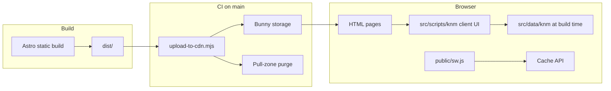

# Architecture

Static Astro site with a client-rendered KNM study app, bilingual routing, and offline-friendly PWA caching.

See [README.md](./README.md) for setup and commands. See [PROJECT.md](./PROJECT.md) for stack and conventions.

## Overview

## Site shell (Astro)

- **Output:** fully static HTML (`output: 'static'` in `astro.config.mjs`).
- **Layout:** `BaseLayout.astro` — skip link, header/footer, SEO (`Seo.astro`), JSON-LD, manifest links.
- **i18n:** Astro built-in routing — English at `/`, Dutch prefixed `/nl/...`; `prefixDefaultLocale: false`.
- **Sitemap:** `@astrojs/sitemap` with `en` / `nl-NL` alternates; requires `SITE_URL` at build time.

## KNM client app

Shell pages (`src/pages/knm/`, `src/pages/nl/knm/`) mount an empty `#knm-app` div and load `src/scripts/knm/index.ts`.

The KNM app is split into focused modules under `src/scripts/knm/`:

| Module           | Responsibility                                       |
| ---------------- | ---------------------------------------------------- |
| `index.ts`       | Boot, locale handoff restore                         |
| `state.ts`       | App state + snapshot read/write                      |
| `exam-engine.ts` | Shuffle, build exam, timer                           |
| `set-state.ts`   | State updates → re-render + persist                  |
| `render.ts`      | View orchestrator                                    |
| `dom/`           | `el()` helper, live-region announcements             |
| `tabs/`          | Tab nav, sticky bar, mobile sheet, a11y sync         |
| `views/`         | One file per screen (home, topics, exam, results, …) |

| Concern     | Implementation                                                                           |
| ----------- | ---------------------------------------------------------------------------------------- |
| Content     | Typed modules under `src/data/knm/` (questions, topics, notes, UI strings)               |
| Rendering   | Vanilla TS DOM updates — text nodes only for user-facing content                         |
| Session     | `src/lib/knm-session.ts` — `sessionStorage` for live exam state and EN/NL locale handoff |
| Tabs / exam | ARIA tab pattern, `aria-live` for feedback, timed mock exams                             |

Data is bundled at build time (no runtime API for question bank).

## Locale switching

`LocaleSwitch.astro` + `locale-switch.ts` navigate between `/path` and `/nl/path`. On switch, `knm-session.ts` can persist scroll position and KNM snapshot via `sessionStorage` so users do not lose exam progress.

## PWA & offline

| File                          | Role                                                                                             |
| ----------------------------- | ------------------------------------------------------------------------------------------------ |
| `public/sw.js`                | Versioned caches; navigate = network-first with `/offline` fallback; static assets = cache-first |
| `public/sw-register.js`       | Registration; unregisters on localhost during dev                                                |
| `public/manifest.webmanifest` | Install metadata                                                                                 |

Dev server bypasses the service worker; test offline with `npm run build` + `npm start`.

## Deployment

Workflow: [`.github/workflows/deploy.yml`](./.github/workflows/deploy.yml)

1. Trigger: push to `main` or `workflow_dispatch`
2. `npm ci` → `npm run build` with secret `SITE_URL`
3. `node scripts/upload-to-cdn.mjs` uploads `dist/` to Bunny storage (`nllearning-prod` zone), then purges the pull zone

Required GitHub secrets: `SITE_URL`, `BUNNY_STORAGE_ACCESS_KEY`, `BUNNY_API_KEY`, `BUNNY_ZONE_ID`.

Upload script fails the job in CI on upload/purge errors; logs only when run locally.

## Cross-cutting concerns

- **SEO:** per-page meta via `BaseLayout` + structured data on key routes (e.g. KNM course JSON-LD).
- **Accessibility:** skip link, landmarks, large touch targets — conventions in [PROJECT.md](./PROJECT.md).
- **Legal pages:** static Astro pages; copy sourced from `src/i18n/legal.ts`.
